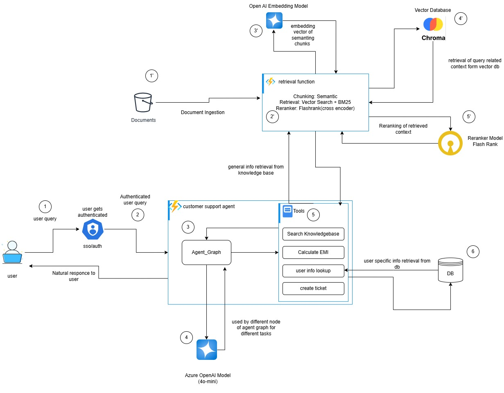
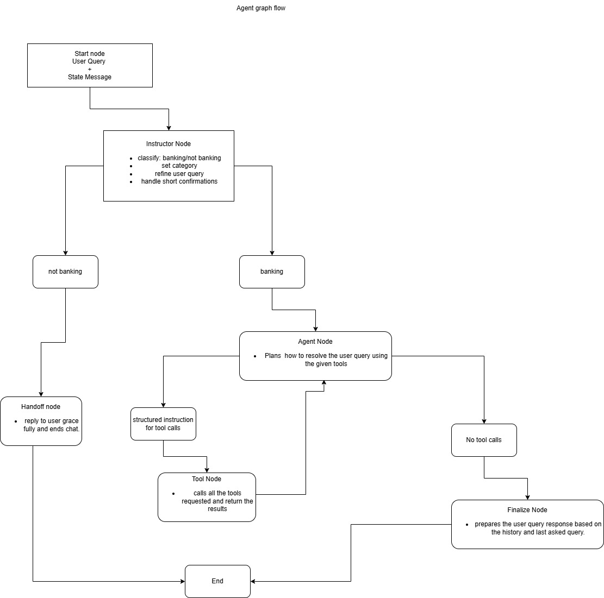
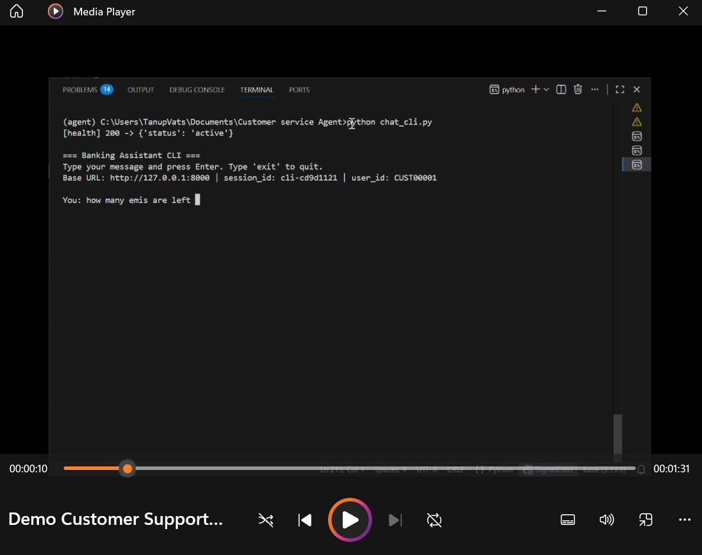
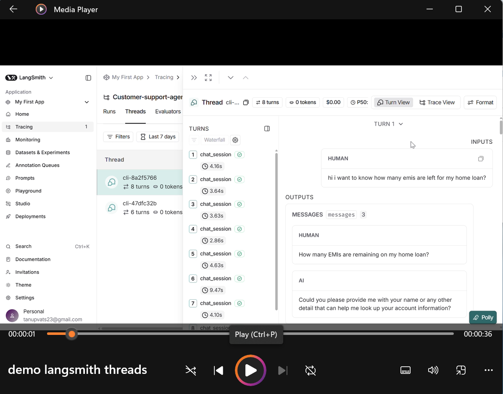

# Customer Support Agent 
**LangGraph · FastAPI · Azure/OpenAI · LangSmith**

A production‑grade **conversational banking customer support agent** built using **LangGraph** for agent orchestration, **FastAPI** for serving, **Azure/OpenAI** for LLM inference, and **LangSmith** for full observability.

The system supports **multi‑turn conversations**, **tool‑based reasoning**, **account‑specific workflows**, and **Responsible AI–friendly** prompting with end‑to‑end tracing.

---
## Scalable high level system design with azure functions

###  HLSD : End‑to‑End customer support agent 

[]()

---

## LangGraph Agent Orchestration and Node Flow

### Node flow of agents and Tool usages

[]()

---

## Demo Videos

### ▶ Video 1: End‑to‑End Banking Support Agent Demo

[](https://ibm-my.sharepoint.com/:v:/p/master_tanup_vats/IQCRf7rgev-3SqoiyCPAzwHkAZFPRLM5Tr6ldBiZnDUK40Q)

**Covers:**
- Multi‑turn conversation handling
- EMI calculation & loan lookup
- Dispute flow with ticket creation
- Context preservation using `session_id`
---

### ▶ Video 2: LangGraph & LangSmith Trace Walkthrough

[](https://ibm-my.sharepoint.com/:v:/p/master_tanup_vats/IQAXf2cnjFuYTpGT2LzSMS1zAfv4sCbUllVqZXvJG4591rc)

**Covers:**
- LangGraph node execution
- Agent ↔ Tool interaction loop
- Tool calls (EMI, lookup, ticketing, RAG)
- LangSmith tracing & thread view
---

##  Key Features

- **Multi‑Turn Agent** with session‑based memory
-  **LangGraph Orchestration** (Instructor → Agent ↔ Tools → Finalize)
-  **Account‑Specific Tools**
  - EMI calculation
  - Loan details & outstanding principal
  - User/account lookup
-  **Operational Workflows**
  - Dispute & fraud ticket creation
-  **Safe Context Switching**
  - Tool state cleanup on intent change
-  **Responsible‑AI Hardened**
  - Azure OpenAI content‑filter friendly
-  **Full Observability**
  - End‑to‑end tracing with LangSmith

---

##  Project Structure

```
customer-support-agent/
│
├── app/
│   ├── retriver           # RAG service
│   ├── server.py          # FastAPI server
│   ├── graph.py           # LangGraph definition
│   ├── nodes.py           # Instructor, Agent, Finalize, Handoff
│   ├── tools.py           # Banking tools (@tool)
│   └── state.py           # AgentState schema
│
├── chat_cli.py                       # CLI demo script
├── Dockerfile                        # containerization
├── video1_thumbnail.png              # Video thumbnail
├── video2_thumbnail.png              # Video thumbnail
├── Customer_Support_Agent.jpg        # Scalable HLDS
├── Customer_Support_Agent_graph_work_flow.jpg   # node flow diagram
├── .env                                         # example env file
├── requirements.txt
└── README.md
```

---

##  Tools Used

| Tool | Description |
|-----|------------|
| `search_knowledgebase` | Product & policy retrieval (RAG) |
| `calculate_emi` | EMI calculation using credit score ladder |
| `user_info_lookup` | Free‑text customer & loan lookup (CSV/DB) |
| `create_ticket` | Dispute/fraud ticket creation (mock) |

> Tools are **category‑scoped** to reduce hallucinations and cost.

---

##  Observability with LangSmith

This project is fully instrumented with **LangSmith**. You can inspect:
- Node‑level execution
- Tool inputs & outputs
- Token usage & latency
- Errors & fallbacks
- Multi‑turn threads by `session_id`


## ▶ Running the Project

### Step 1:  Install Dependencies
```bash
pip install -r requirements.txt
```

### Step 2: Configure Environment
Create a `.env` at repo root:
```env
# LangSmith
LANGCHAIN_TRACING_V2=true
LANGCHAIN_API_KEY=lsv2_XXXX
LANGCHAIN_PROJECT=Customer-support-agent

# Azure OpenAI
AZURE_OPENAI_API_KEY=...
AZURE_OPENAI_ENDPOINT=...
AZURE_OPENAI_DEPLOYMENT=...
AZURE_OPENAI_API_VERSION=2024-02-15-preview

AZURE_OPENAI_API_KEY_EMBEDDING=.....
AZURE_OPENAI_ENDPOINT_EMBEDDING=.....
AZURE_OPENAI_DEPLOYMENT_EMBEDDING=......  
AZURE_OPENAI_API_VERSION_EMBEDDING="2024-12-01-preview"

```

### Step 3: Start Server
```bash
uvicorn app.server:app --reload
```

### Step 4: Start CLI
```bash
python chat_cli.py
```

---

##  Example Conversations

- *“How many EMIs are left for my home loan?”*
- *“EMI for ₹15,00,000, 4 years, credit score 770?”*
- *“I paid 15 EMIs but only 13 are showing—create a ticket.”*
- *“Recommend some credit cards I can apply for.”*

---

##  Responsible AI Considerations

- Descriptive, non‑procedural system prompts
- Tool context is reset on topic change
- Safe fallback on Azure content‑filter violations
- PII‑aware prompting and logging

---

##  Author

**Tanup Vats**  
Senior Data Scientist
